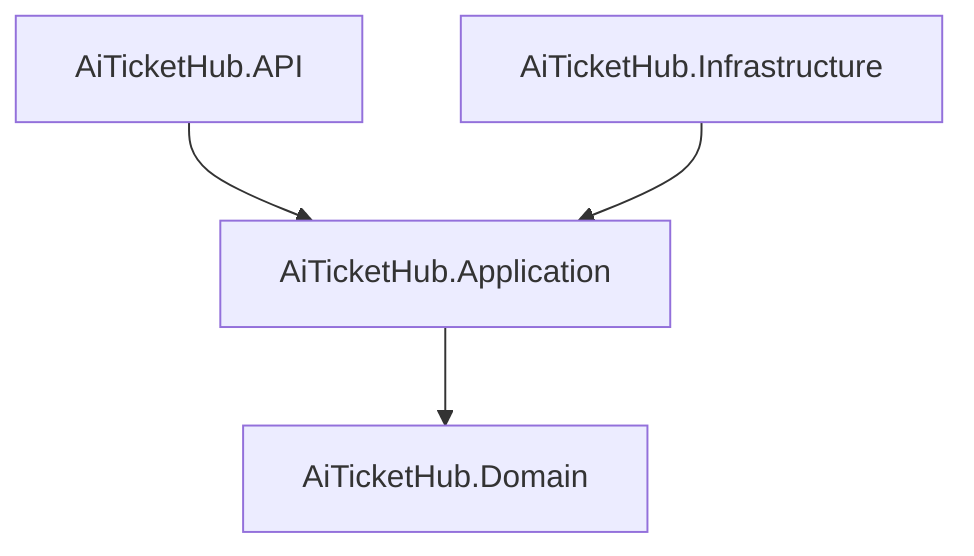
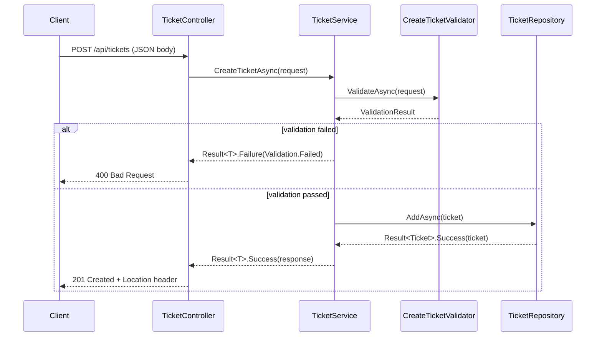

# Architecture

## Overview

AiTicketHub is a customer support ticket management API that persists tickets in memory and classifies them using keyword analysis. It is built on .NET 9 with ASP.NET Core. It follows Clean Architecture, which enforces a strict inward dependency rule: outer layers depend on inner layers and never the reverse.

## Layer Dependency Diagram

## Layer Responsibilities

**Domain** owns the `Ticket` entity, all enums, the `Result<T>` type, and the error catalogue. It contains no framework references and no I/O of any kind.

**Application** owns service interfaces (`ITicketService`, `ITicketRepository`, `IClassificationService`), DTOs, FluentValidation validators, and the `TicketService` orchestration logic. It depends only on Domain and never directly imports infrastructure types.

**Infrastructure** owns the concrete implementations: `TicketRepository` (in-memory `ConcurrentDictionary`), `KeywordClassifier`, and the three file parsers (CSV, JSON, XML). It depends on Application interfaces and fulfils them, keeping all I/O and third-party library references isolated in this layer.

**API** owns the ASP.NET Core controller, `Program.cs`, DI registration, and Swagger configuration. It translates HTTP requests into Application calls and maps `Result<T>` outcomes to HTTP status codes. It has no domain logic of its own.

## Request Lifecycle

The following diagram traces a `POST /api/tickets` request through the stack.

## Key Design Decisions

### Result&lt;T&gt; Pattern

All service and repository methods return `Result<T>` (or `Result` for void operations) instead of throwing exceptions. This makes every failure path explicit and visible in the call signature, eliminates silent exception propagation across layer boundaries, and forces callers to handle errors before accessing values. The trade-off is a small amount of boilerplate at each call site.

### ConcurrentDictionary for In-Memory Storage

The repository uses `ConcurrentDictionary<Guid, Ticket>` to store tickets without an external database dependency. This makes the project self-contained and eliminates infrastructure setup for evaluators. The trade-off is that all data is lost on restart and horizontal scaling is not possible without replacing the storage layer.

### FluentValidation in the Application Layer

Validation rules live in the Application layer alongside the service they protect, so request contracts and their constraints are co-located and easy to find. FluentValidation's `AddFluentValidationAutoValidation()` runs validators as ASP.NET middleware, which means 400 responses are produced before the controller action body executes. The trade-off is that the middleware returns ASP.NET's `ValidationProblemDetails` shape rather than the project's own error envelope.

### Clean Architecture Four-Layer Dependency Rule

Each layer may only reference the layer immediately inside it (see the dependency diagram above). This prevents infrastructure details from leaking into domain or application logic, makes each layer independently testable, and enables the storage or classification implementation to be swapped without touching Application or Domain. The trade-off is additional mapping code when moving data between layers.

## Constraints and Trade-offs

**This design optimises for:**

- Evaluator experience — no external services required to run or test
- Testability — every component is reachable through its interface
- Separation of concerns — each layer owns exactly one concern
- Error transparency — every failure path is a typed return value
- Fast feedback — the full test suite runs in under 5 seconds

**This design sacrifices:**

- Persistence across restarts — data is lost when the process exits
- Horizontal scalability — the in-memory store is local to one process
- Production-grade classification — keyword matching does not generalise beyond the defined vocabulary
