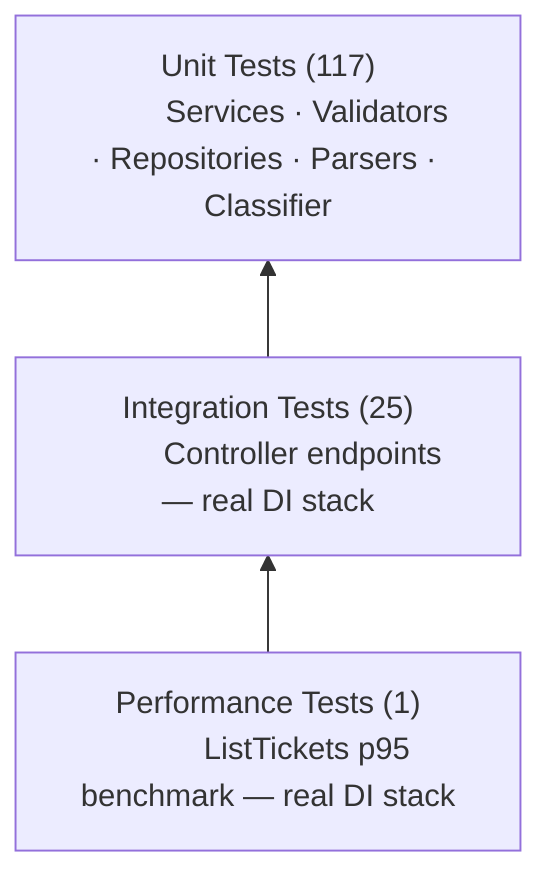

# Testing Guide

## Test Pyramid



Total: **143 tests** across all layers.

## Running Tests

Run all tests:

```bash
dotnet test AiTicketHub.sln
```

Expected: `143 passed, 0 failed.`

Run unit tests only (Application + Infrastructure):

```bash
dotnet test AiTicketHub.sln --filter "FullyQualifiedName~Application|FullyQualifiedName~Infrastructure"
```

Expected: `117 passed, 0 failed.`

Run API tests only (integration + performance):

```bash
dotnet test AiTicketHub.sln --filter "FullyQualifiedName~AiTicketHub.Tests.API"
```

Expected: `26 passed, 0 failed.`

Run with code coverage report:

```bash
dotnet test AiTicketHub.sln --collect:"XPlat Code Coverage" --results-directory ./coverage-results
```

Generate an HTML report from the output (requires `dotnet-reportgenerator-globaltool`):

```bash
dotnet tool install -g dotnet-reportgenerator-globaltool
reportgenerator -reports:"coverage-results/**/coverage.cobertura.xml" \
                -targetdir:"coverage-results/html" \
                -reporttypes:"Html"
```

Open `coverage-results/html/index.html` in a browser.

## Test Structure

```
tests/AiTicketHub.Tests/
├── Application/
│   ├── TicketServiceTests.cs          # Service orchestration — all code paths
│   ├── CreateTicketValidatorTests.cs  # Every field and boundary for create
│   └── UpdateTicketValidatorTests.cs  # Every field and boundary for update
├── Infrastructure/
│   ├── TicketRepositoryTests.cs       # All CRUD methods + concurrency
│   ├── KeywordClassifierTests.cs      # Category, priority, confidence, reasoning
│   └── Parsers/
│       ├── CsvTicketParserTests.cs    # Valid CSV, malformed rows, edge cases
│       ├── JsonTicketParserTests.cs   # Valid JSON, invalid fields, edge cases
│       └── XmlTicketParserTests.cs   # Valid XML, missing elements, malformed
└── API/
    ├── TicketControllerTests.cs       # Per-endpoint status code and body tests
    ├── IntegrationTests.cs            # Full lifecycle and multi-step scenarios
    └── PerformanceTests.cs            # ListTickets p95 latency benchmark
```

## Naming Convention

Every test method follows the pattern:

```
MethodName_StateUnderTest_ExpectedBehavior
```

Examples from the test suite:

- `CreateTicketAsync_ValidRequest_ReturnsSuccessWithId`
- `GetByIdAsync_UnknownId_ReturnsNotFoundError`
- `ListTickets_FilterByCategoryAndPriority_ReturnsOnlyMatchingTickets`

## Test Categories and What They Cover

| Category | Files | What Is Tested | Dependencies Mocked |
|----------|-------|----------------|---------------------|
| Service unit tests | `Application/TicketServiceTests.cs` | Orchestration logic — happy path and every `Result.Failure` branch | `ITicketRepository`, `IClassificationService` |
| Validator unit tests | `Application/CreateTicketValidatorTests.cs`, `UpdateTicketValidatorTests.cs` | Every field constraint in isolation — boundary values and violations | None |
| Repository unit tests | `Infrastructure/TicketRepositoryTests.cs` | All CRUD methods, duplicate detection, concurrent write safety | None — real `ConcurrentDictionary` |
| Classifier unit tests | `Infrastructure/KeywordClassifierTests.cs` | All category and priority keyword paths, confidence bounds, reasoning text | None — real `KeywordClassifier` |
| Parser unit tests | `Infrastructure/Parsers/*Tests.cs` | Valid input, malformed rows, missing required fields, extra fields ignored | None — real parsers |
| Controller integration tests | `API/TicketControllerTests.cs` | Per-endpoint HTTP status codes and response body shape | None — `WebApplicationFactory<Program>` |
| Integration scenarios | `API/IntegrationTests.cs` | Full lifecycle, bulk import + classify, concurrency, combined filters | None — `WebApplicationFactory<Program>` |
| Performance tests | `API/PerformanceTests.cs` | p95 response time for `GET /api/tickets` with 1 000 seeded tickets | None — `WebApplicationFactory<Program>` |

## Adding a New Test

### Unit test for a new service method

1. Open (or create) the relevant `*ServiceTests.cs` file in `tests/AiTicketHub.Tests/Application/`.
2. Add a `[SetUp]` that creates a fresh `Mock<ITicketRepository>` and a new `TicketService` instance.
3. Configure the mock with `.Setup(r => r.SomeMethod(...)).ReturnsAsync(Result<T>.Success(...))` for the happy path.
4. Write one `[Test]` for the happy path and one `[Test]` per distinct failure path.
5. Assert `result.IsSuccess` before asserting `result.Value` or `result.Error`.

### Integration test for a new endpoint

1. Add a new `[Test]` method in `tests/AiTicketHub.Tests/API/TicketControllerTests.cs`.
2. Use the shared `_client` (created in `[SetUp]` from `WebApplicationFactory<Program>`) to send the request.
3. Assert the HTTP status code first, then deserialise and assert relevant response fields.
4. For scenarios that require prior state (e.g. a ticket must exist), call the existing `CreateTicketAndGetId` helper.

## Coverage Expectations

| Layer | Target | Achieved |
|-------|--------|---------|
| Overall | > 85% line | 93.8% line, 76.3% branch |
| Application | > 90% | Covered by service + validator unit tests |
| Infrastructure | > 85% | Covered by repository, parser, and classifier unit tests |
| API | > 80% | Covered by controller integration and scenario tests |

See [Architecture](ARCHITECTURE.md) for layer definitions and [API Reference](API_REFERENCE.md) for endpoint contracts.
